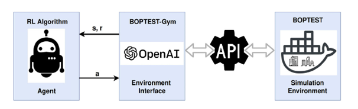
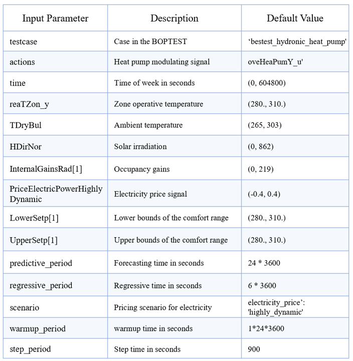
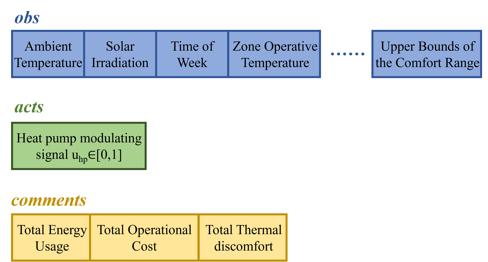
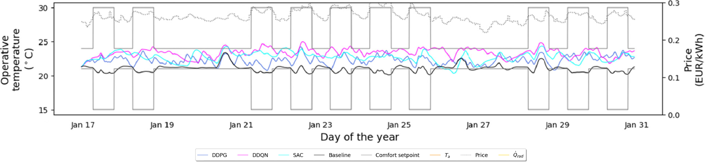
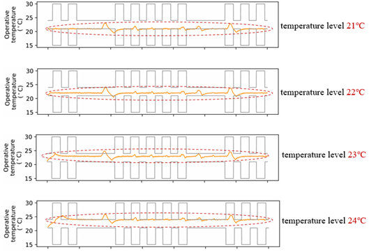
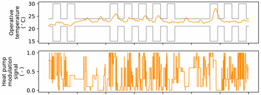
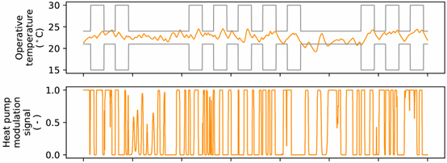

# boptest-gym-master-test

This is the test repository of BESTEST Hydronic Heat Pump, an OpenAI Gym Environment for Thermally Controlled Loads. The original idea to this environment can be found in the following paper:

> *Wang, D., Zheng, W., Wang, Z., Wang, Y., Pang, X., & Wang, W. (2023). Comparison of reinforcement learning and model predictive control for building energy system optimization. Applied Thermal Engineering, 228, 120430.*


# Overview
The Heating, ventilation and air conditioning (HVAC) system typically accounts for around 50 % of overall building energy use, and is expected to consume more energy with the on-going trend of global warming. Advanced building control is a promising technology to minimize the HVAC system energy use, provide load flexibility, reduce the connected grid overvoltage risks, as well as improve the indoor environment quality.

The paper developed MPC and DRL controller for space heating systems, and compared their performance in one virtual testbed, examining the control behavior, quantifying the control performance. In this repository:a. the realistic virtual environment related to RL in the paper is reproduced; b. some original and reproduced results are showed for discussion.


# Code Usage
### Clone repository
```
git clone https://github.com/Szk-GH/boptest-gym-master-test.git
cd boptest-gym-master-test
```

### Set up the environment
Set up the virtual environment with the ‘environment.yml’.

The Docker is deployed on local computing resource.

The instruction here is based on **conda**.


### Repository structure

``data``: Raw data used in this repo

``docs``: Manuscript submitted version

``RL-results``: Results in this repo

``testing``: Runnable code

### Running
The reproduced examples can be replicated using codes in ``testing``: `test_paper_case_PI.py`, `test_paper_case_DQN.py`, `test_paper_case_DDPG.py`

# Interface
The details of BESTEST Hydronic Heat Pump are:

- A single zone dwelling in Belgium: 12 × 16 meters rectangular floor plan; approximately 80 W/m2 heading demand in winter
- Five family members
- Occupied: 0:00-7:00, 20:00-24:00 on weekdays; 0:00-24:00 on weekends
- Comfort conditions: 21-24 ℃ during occupied hours; 15-30℃ otherwise
- Heating system: 15 kW nominal thermal capacity; 3.5 kW nominal power consumption

The interaction process between the RL controller and BOPTEST simulation environment with the aid of BOPTEST-Gym is:




The first step is to initiate the environment. A list of input parameters to set up the environment is shown as follows:




Then at each time step, the environment consumes ``acts`` (determined by the controller), runs a single time step simulation, and returns ``obs`` and ``comments``. The contents of ``acts``, ``obs``, and ``comments`` are shown as follows:




# Application
``boptest-gym-master-test`` can reproduce most part of RL control for heat pump. The original and reproduced results are showed here:

## The original

The indoor temperature variations are plotted during the peak heating period.



### (a) Baseline PI controller:

*Operative temperature*:

- the indoor temperature at the lower end of the comfort range
- high chance of comfort violation
- temperature level 24℃

*performance*:

| Keys     | Value    |
|----------|----------|
| tdis_tot | 8.38     |
| cost_tot | 0.91     |
| ener_tot | 3.48     |

### (b) DDPG controller:

*Operative temperature*:

- temperature level 22-23℃
- learn to pre-heat the building when the ToU price is lower

*performance*:

| Keys     | Value |
|----------|-------|
| tdis_tot | 0.75  |
| cost_tot | 0.81  |
| ener_tot | 3.09  |


## The reproduced

### (a) PI controller:

PI controller is implemented in ``test_paper_case_PI.py`` , and the zone operative setpoint temperature differs from 22℃ to 24℃. Here is the result:



*performance*:

| Keys     | Value(21℃) | Value(22℃) | Value(23℃) | Value(24℃) |
|----------|------------|------------|------------|------------|
| tdis_tot | 29.35      | 1.47       | 3.19       | 27.79      |
| cost_tot | 0.64       | 0.71       | 0.79       | 0.87       |
| ener_tot | 2.44       | 2.72       | 3.00       | 3.31       |

### (b) DQN controller: 

DQN controller is implemented in ``test_paper_case_DQN.py``, and here is the result:




*Operative temperature*:

- temperature level 22-23℃

*performance*:

| Keys     | Value |
|----------|-------|
| tdis_tot | 12.61 |
| cost_tot | 0.99  |
| ener_tot | 3.77  |

### (c) DDPG controller: 

DDPG controller is implemented in ``test_paper_case_DDPG.py``, and here is the result:



*performance*:

| Keys     | Value |
|----------|-------|
| tdis_tot | 13.44 |
| cost_tot | 0.82  |
| ener_tot | 3.13  |

# Discussion

- For a PI controller, total thermal discomfort and total cost change when the operative setpoint temperature varies from 21℃ to 24 ℃. Total thermal discomfort could be worse when the setpoint temperature is set at the edge of the comfort range, but improved total thermal discomfort usually means more total operative cost and energy. Therefore, it is fair and make sense to choose an appropriate baseline for comparison.
- For the RL controller (DDPG), there are some differences between the original and reproduced models, likely due to subtle differences in the algorithm's structure. Nevertheless, both of them show the advantage of RL when considering the electricity prices and thermal comfort. Future research could explore the optimal hyperparameters of the algorithm. Additionally, the optimal hyperparameters may vary between different algorithms, meaning that comparing them requires more effort.
- Personally, it would be better to choose a baseline for specific people and occasion, because the operative temperature ranging from 21℃ to 24℃ has different effects on people of different ages and activities (please refer to the paper: *Towards various occupants with different thermal comfort requirements：A deep reinforcement learning approach combined with a dynamic PMV model for HVAC control in buildings*). I believe this will be more persuasive to show advantages and disadvantages of PI controller and RL controller when we talk about their real-world applications (for example, in infant care units or nursing homes, where higher operative temperature and tighter temperature control are often required due to the high costs of illness). For a more meaningful experiment, it would be better to determine the concrete temperature level and total thermal discomfort before evaluating the total cost, and vice versa.


# Citation

Please use the following reference if you used this repository for your research.

```
@inproceedings and article{boptestgym2021,
	title = {{An OpenAI-Gym environment for the Building Optimization Testing (BOPTEST) framework}},
	author = {Javier Arroyo and Carlo Manna and Fred Spiessens and Lieve Helsen and Dan Wang and Wanfu Zheng and Zhe Wang and Yaran Wang and Xiufeng Pang and Wei Wang and Zekun Shi},
	journal = {Applied Thermal Engineering},
	publisher={Elsevier}
	year = {2025},
	month = {August},
}
```
